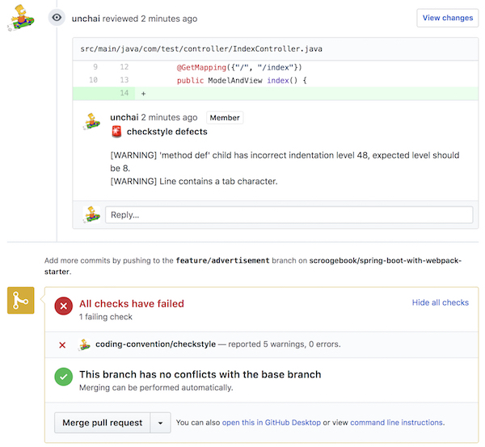

# checkstyle-github-gradle-plugin

[](https://travis-ci.org/unchai/checkstyle-github-gradle-plugin)

A gradle plug-in that leaves the result of a checkstyle of a project as a comment on github's pull request.



### Requirements

* Gradle 4.6+
* Java 8

### Install

```
plugins {
  id "com.github.unchai.checkstyle-github" version "0.0.3"
}

checkstyleGithub {
  toolVersion = "8.30"
  ghEndpoint = "https://api.github.com"
  ghRepository = "owner/repo"
  configLocation = <Checkstyle ruleset path>
}
```

### Usage

```shell
$ gradlew checkstyleGithub \
    --githubOAuth=<github oauth token> \
    --githubPullRequest=<pull request id>
```

#### with Jenkinsfile

```
node {
    stage('lint') {
        if (env.CHANGE_ID) {
            withCredentials([[$class: 'StringBinding', credentialsId: 'github-bot', variable: 'GITHUB_ACCESS_TOKEN']]) {
                sh "'${pwd()}/gradlew' checkstyleGithub" +
                   " --githubOAuth=${GITHUB_ACCESS_TOKEN}" +
                   " --githubPullRequest=${env.CHANGE_ID}"
            }
        }
    }
}
```

## License

Apache License 2.0 © 2020 [unchai](https://github.com/unchai)
